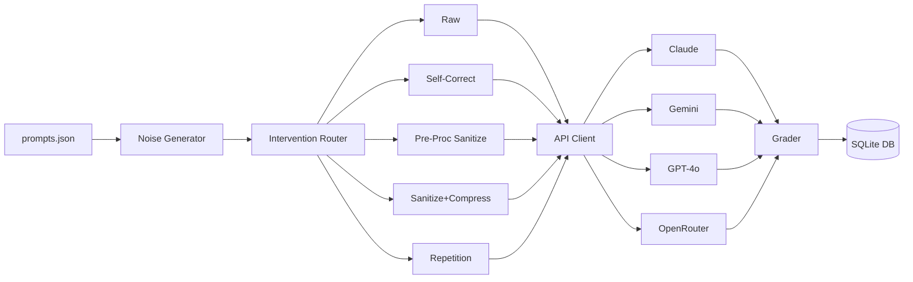
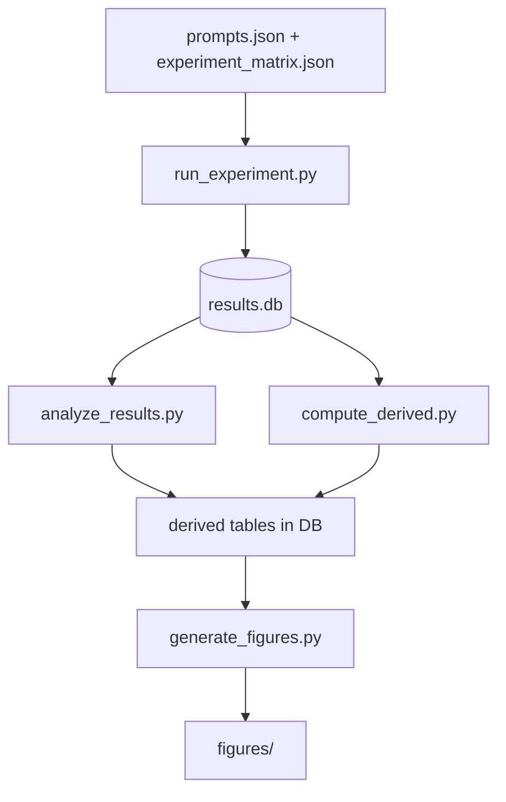

<objective>
Create the architecture deep-dive and getting-started walkthrough docs. The architecture doc explains how all 18 modules connect with Mermaid diagrams for pipeline architecture, data flow, CLI command map, and API call lifecycle. The getting-started guide provides a runnable end-to-end walkthrough from clone to viewing results, plus additional scenario walkthroughs.

Purpose: Architecture doc serves developers understanding the system; getting-started serves new users running their first experiment.
Output: `docs/architecture.md`, `docs/getting-started.md`
</objective>

<execution_context>
@/home/steve/linguistic-tax/.claude/get-shit-done/workflows/execute-plan.md
@/home/steve/linguistic-tax/.claude/get-shit-done/templates/summary.md
</execution_context>

<context>
@.planning/PROJECT.md
@.planning/ROADMAP.md
@.planning/STATE.md
@.planning/phases/12-comprehensive-documentation-and-readme-for-new-users/12-CONTEXT.md
@.planning/phases/12-comprehensive-documentation-and-readme-for-new-users/12-RESEARCH.md
</context>

<tasks>

<task type="auto">
  <name>Task 1: Create docs/architecture.md with module reference and diagrams</name>
  <files>docs/architecture.md</files>
  <read_first>
    - src/cli.py (CLI entry point, subcommand registration)
    - src/config.py (ExperimentConfig, constants, MODELS, PRICE_TABLE, INTERVENTIONS, NOISE_TYPES)
    - src/run_experiment.py (execution engine, run_engine function)
    - src/api_client.py (multi-provider API wrapper, call_model routing)
    - src/noise_generator.py (Type A and Type B noise generation)
    - src/prompt_compressor.py (sanitize and compress functions)
    - src/grade_results.py (grading pipeline)
    - src/analyze_results.py (statistical analysis)
    - src/compute_derived.py (derived metrics)
    - src/generate_figures.py (figure generation)
    - src/db.py (SQLite schema and queries)
    - src/execution_summary.py (pre-execution summary)
    - src/pilot.py (pilot validation)
    - .planning/phases/12-comprehensive-documentation-and-readme-for-new-users/12-RESEARCH.md (diagram specifications, verified project structure)
  </read_first>
  <action>
Create docs/architecture.md with the following sections. Use American English. Technical-direct tone.

**Section 1: Overview**
- Brief paragraph: research toolkit architecture, NOT a web service, batch processing pipeline
- High-level pipeline description: prompts -> noise -> interventions -> API calls -> grading -> analysis -> figures

**Section 2: Pipeline Architecture Diagram (Mermaid)**
Mermaid flowchart LR (Diagram 1 from RESEARCH.md):


**Section 3: Data Flow Diagram (Mermaid)**
Mermaid flowchart TD (Diagram 2 from RESEARCH.md):


**Section 4: CLI Command Map Diagram (Mermaid)**
Diagram 4 from RESEARCH.md -- flowchart showing how propt subcommands map to modules.

**Section 5: API Call Lifecycle Sequence Diagram (Mermaid)**
Diagram 5 from RESEARCH.md -- sequenceDiagram showing: run_engine -> InterventionRouter -> [optional: PreProcessor API] -> TargetModel API -> Grader -> DB.insert. Include TTFT/TTLT timing points.

**Section 6: Module Reference**
Table with one row per module (all 18 in src/). Columns: Module, Purpose, Key Functions/Classes, Dependencies. Group by layer:
- Configuration: config.py, config_manager.py, config_commands.py
- Data: db.py, noise_generator.py
- Interventions: prompt_compressor.py, prompt_repeater.py
- Execution: run_experiment.py, api_client.py, execution_summary.py, pilot.py
- Grading: grade_results.py
- Analysis: analyze_results.py, compute_derived.py
- Visualization: generate_figures.py
- CLI: cli.py, setup_wizard.py

For each module, list the 2-4 most important public functions with one-line descriptions. Get these from actually reading the module files -- do NOT guess.

**Section 7: Database Schema**
Describe the SQLite tables (experiment_runs, derived_metrics, grading_details) with key columns. Reference src/db.py for exact schema.

**Section 8: Configuration System**
- ExperimentConfig frozen dataclass with key fields
- Sparse override pattern (experiment_config.json stores only overrides, defaults from ExperimentConfig)
- Config validation rules
- Link to CLI reference in README for config subcommands

**Section 9: Cross-References**
- Link to [RDD](RDD_Linguistic_Tax_v4.md) for experimental parameters
- Link to [Getting Started](getting-started.md) for running experiments
- Link to [Analysis Guide](analysis-guide.md) for interpreting results
  </action>
  <verify>
    <automated>test -f docs/architecture.md && grep -c "```mermaid" docs/architecture.md | xargs test 3 -le && grep -q "## Module Reference" docs/architecture.md && grep -q "run_experiment" docs/architecture.md && grep -q "api_client" docs/architecture.md && grep -q "sequenceDiagram" docs/architecture.md && echo "PASS"</automated>
  </verify>
  <acceptance_criteria>
    - docs/architecture.md exists
    - Contains at least 4 Mermaid diagrams (pipeline, data flow, CLI map, API lifecycle)
    - Contains "## Module Reference" section listing all 18 src/ modules
    - Contains "sequenceDiagram" for API call lifecycle
    - Contains "flowchart" for pipeline architecture
    - Contains links to RDD_Linguistic_Tax_v4.md, getting-started.md, analysis-guide.md
    - Lists key public functions for each module (verified from source)
    - Contains database schema description mentioning experiment_runs, derived_metrics, grading_details tables
  </acceptance_criteria>
  <done>docs/architecture.md has 4+ Mermaid diagrams, module reference for all 18 modules with verified public functions, database schema, configuration system, and cross-references to other docs</done>
</task>

<task type="auto">
  <name>Task 2: Create docs/getting-started.md with end-to-end walkthrough</name>
  <files>docs/getting-started.md</files>
  <read_first>
    - src/cli.py (exact subcommand flags for setup, pilot, run)
    - src/config.py (ExperimentConfig defaults, MODELS list)
    - src/pilot.py (pilot execution flow)
    - src/execution_summary.py (summary display format)
    - src/setup_wizard.py (wizard flow and questions)
    - pyproject.toml (dependencies, entry point)
    - .planning/phases/12-comprehensive-documentation-and-readme-for-new-users/12-RESEARCH.md (environment variables, CLI commands)
  </read_first>
  <action>
Create docs/getting-started.md with the following sections. American English. Commands first, prose second.

**Section 1: Prerequisites**
- Python >= 3.11 (check: `python --version`)
- At least one API key: ANTHROPIC_API_KEY, GOOGLE_API_KEY, OPENAI_API_KEY, or OPENROUTER_API_KEY
- ~500MB disk for dependencies
- Note: OpenRouter with free Nemotron models requires no API spend

**Section 2: Installation**
Step-by-step:
```bash
git clone https://github.com/<user>/linguistic-tax.git
cd linguistic-tax
python -m venv .venv
source .venv/bin/activate   # On Windows: .venv\Scripts\activate
pip install -e .
```
Verify: `propt --help` should list all subcommands.

**Section 3: Configuration**
- Set environment variables (4 API keys, explain each provider)
- Run `propt setup` -- describe each wizard question (provider selection, model auto-fill, path config)
- Alternative: manual config via `propt set-config` for each property
- Validate: `propt validate`

**Section 4: Full Experiment Run Sequence Diagram (Mermaid)**
Diagram 6 from RESEARCH.md -- sequenceDiagram showing end-to-end flow from `propt run` through to results.

**Section 5: Walkthrough 1 -- First Pilot Run (Primary)**
Step-by-step numbered guide:
1. `propt pilot --dry-run` -- review what will run, show example output
2. `propt pilot` -- run the 20-prompt pilot, explain confirmation gate
3. After completion: what's in results.db
4. View results: `python -m src.analyze_results results/results.db` (explain output)
5. Generate figures: `python -m src.generate_figures results/results.db`
6. View derived metrics: `python -m src.compute_derived results/results.db`

**Section 6: Walkthrough 2 -- Custom Experiment**
- Limit by model: `propt run --model claude-sonnet-4-20250514 --limit 50`
- Limit by intervention: `propt run --intervention raw --intervention self_correct`
- Budget gate: `propt run --budget 5.00` (fail if >$5)
- Resume failed: `propt run --retry-failed`
- Scripted/CI: `propt run --yes --budget 10.00`

**Section 7: Walkthrough 3 -- Analyzing Existing Results**
- If someone shares a results.db file:
  1. `python -m src.compute_derived results/results.db`
  2. `python -m src.analyze_results results/results.db`
  3. `python -m src.generate_figures results/results.db`
- Link to [Analysis Guide](analysis-guide.md) for interpreting output

**Section 8: Configuration Deep Dive**
- `propt show-config` -- see all settings
- `propt show-config --changed` -- see only modified
- `propt diff` -- diff from defaults
- `propt list-models` -- see available models with pricing
- Reset: `propt reset-config --all`

**Section 9: Troubleshooting**
Common issues:
- "Config not found" -- run `propt setup` first
- API key errors -- check env vars are exported
- Rate limiting -- toolkit has built-in retry/delay logic, but reduce --limit if persistent
- Python version -- must be >= 3.11

**Section 10: Next Steps**
- [Architecture](architecture.md) for understanding the codebase
- [Analysis Guide](analysis-guide.md) for interpreting results
- [RDD](RDD_Linguistic_Tax_v4.md) for full experimental methodology
- [Experiment Specs](experiments/README.md) for micro-formatting test designs
  </action>
  <verify>
    <automated>test -f docs/getting-started.md && grep -q "## Prerequisites" docs/getting-started.md && grep -q "propt pilot" docs/getting-started.md && grep -q "propt setup" docs/getting-started.md && grep -q "pip install" docs/getting-started.md && grep -q "sequenceDiagram" docs/getting-started.md && echo "PASS"</automated>
  </verify>
  <acceptance_criteria>
    - docs/getting-started.md exists
    - Contains "## Prerequisites" with Python >= 3.11 requirement
    - Contains "pip install -e ." command
    - Contains at least 3 walkthrough sections (pilot, custom experiment, analyzing results)
    - Contains Mermaid sequenceDiagram for full experiment run flow
    - Contains all 4 API key env var names
    - Contains `propt setup`, `propt pilot`, `propt run` commands with flags
    - Contains troubleshooting section
    - Contains links to architecture.md, analysis-guide.md, RDD_Linguistic_Tax_v4.md
  </acceptance_criteria>
  <done>docs/getting-started.md provides 3 runnable walkthroughs (pilot, custom experiment, analyzing results), Mermaid sequence diagram, troubleshooting, and cross-references</done>
</task>

</tasks>

<verification>
- docs/architecture.md has 4+ Mermaid diagrams and references all 18 modules
- docs/getting-started.md has runnable commands and 3 walkthrough scenarios
- Cross-links between the two docs work
- No references to only 2 providers (must mention all 4)
</verification>

<success_criteria>
- Architecture doc fully describes the system for a developer new to the codebase
- Getting-started guide is followable from fresh clone to first pilot results
- All Mermaid diagrams use well-supported syntax (flowchart, sequenceDiagram)
- All CLI commands and flags verified against src/cli.py source
</success_criteria>

<output>
After completion, create `.planning/phases/12-comprehensive-documentation-and-readme-for-new-users/12-02-SUMMARY.md`
</output>
