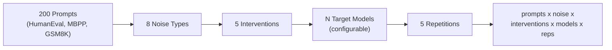

# The Linguistic Tax

**Quantifying Prompt Noise and Bloat in LLM Reasoning, and the Case for Automated Prompt Optimization**

> Research toolkit -- not a web service

How do typos, grammatical errors, and verbose prompts degrade LLM reasoning accuracy? This project measures the "linguistic tax" -- the accuracy penalty that noisy, unpolished prompts impose on large language models. We quantify degradation across multiple noise types and severity levels, then build and test a prompt optimizer (sanitizer + compressor) that recovers lost accuracy and reduces token costs.

The toolkit implements a full factorial experiment across configurable model providers, 8 noise conditions, and 5 intervention strategies. It also tests Google's prompt repetition technique (Leviathan et al.) as a zero-cost alternative to pre-processing. Results feed a forthcoming ArXiv paper with GLMM (Generalized Linear Mixed Model) analysis, bootstrap confidence intervals, and publication-ready figures.

## Quick Start

```bash
git clone https://github.com/sscargal/linguistic-tax.git
cd linguistic-tax
uv sync
uv run propt setup    # Wizard handles API keys, model config, and validation
```

## Installation

### Prerequisites

- Python >= 3.12
- **[uv](https://docs.astral.sh/uv/)** -- install with `curl -LsSf https://astral.sh/uv/install.sh | sh`
- At least one LLM provider API key (see below)

### Setup

```bash
# Clone and install
git clone https://github.com/sscargal/linguistic-tax.git
cd linguistic-tax
uv sync
```

### API Keys

Set your API keys so the toolkit can authenticate with LLM providers. Only one provider is required at minimum, but the full experiment matrix uses all four.

**Option 1: `.env` file (recommended)**

Create a `.env` file at the project root (or let `propt setup` create it for you):

```
ANTHROPIC_API_KEY=sk-ant-...
GOOGLE_API_KEY=AIza...
OPENAI_API_KEY=sk-...
OPENROUTER_API_KEY=sk-or-...
```

**Option 2: Shell environment variables**

```bash
export ANTHROPIC_API_KEY="sk-ant-..."     # For Claude models
export GOOGLE_API_KEY="AIza..."           # For Gemini models
export OPENAI_API_KEY="sk-..."            # For GPT models
export OPENROUTER_API_KEY="sk-or-..."     # For OpenRouter models (free Nemotron)
```

> **Tip:** OpenRouter provides free access to Nemotron models, making it a zero-cost option for initial experiments.

### Configuration

Run the guided setup wizard to configure your experiment:

```bash
propt setup
```

The wizard walks you through a multi-provider configuration flow:

1. **Provider loop** -- configure 1-4 providers per session (Anthropic, Google, OpenAI, OpenRouter)
2. **Model entry** -- enter model IDs or accept defaults for each provider
3. **API key management** -- creates or updates your `.env` file with provider keys
4. **Validation pings** -- tests each configured model with a live API call
5. **Budget preview** -- shows estimated cost before committing the configuration

For CI or scripting, use `propt setup --non-interactive` to write defaults without prompting.

For individual property overrides, use `propt set-config` (see [CLI Reference](#cli-reference) below).

Verify your configuration:

```bash
propt validate
propt show-config --changed
```

## CLI Reference

The `propt` CLI provides 9 subcommands for configuring and running experiments.

| Command | Description | Key Flags |
|---------|-------------|-----------|
| `propt setup` | Guided setup wizard | `--non-interactive` |
| `propt show-config` | Display current configuration | `[property]`, `--json`, `--changed`, `--verbose` |
| `propt set-config` | Set configuration properties | `key value [key value ...]` |
| `propt reset-config` | Reset properties to defaults | `[properties ...]`, `--all` |
| `propt validate` | Validate current configuration | *(none)* |
| `propt diff` | Show properties changed from defaults | *(none)* |
| `propt list-models` | List available models with pricing | `--json` |
| `propt run` | Run experiments with confirmation gate | `--model`, `--limit`, `--intervention`, `--dry-run`, `--yes`, `--budget`, `--retry-failed`, `--db` |
| `propt pilot` | Run pilot validation (20 prompts) | `--dry-run`, `--yes`, `--budget`, `--db` |

### Detailed Examples

#### `propt setup` -- Guided Configuration

```bash
# Interactive setup (recommended for first use)
propt setup

# Non-interactive setup with defaults (CI/scripting)
propt setup --non-interactive
```

#### `propt run` -- Running Experiments

```bash
# Dry run: preview cost and experiment count without executing
propt run --dry-run

# Run experiments for a single provider
propt run --model claude

# Run with a specific intervention only
propt run --intervention pre_proc_sanitize

# Limit to first 100 work items
propt run --limit 100

# Auto-accept confirmation gate with budget cap
propt run --yes --budget 50.00

# Retry previously failed items
propt run --retry-failed

# Use a custom database path
propt run --db results/custom.db
```

The `--model` flag accepts: `claude`, `gemini`, `gpt`, `openrouter`, or `all` (default).

The `--intervention` flag accepts: `raw`, `self_correct`, `pre_proc_sanitize`, `pre_proc_sanitize_compress`, or `prompt_repetition`.

#### `propt pilot` -- Pilot Validation

```bash
# Dry run: preview pilot cost and experiment count
propt pilot --dry-run

# Run pilot with auto-accept and budget cap
propt pilot --yes --budget 200.00

# Run pilot with custom database
propt pilot --db results/pilot.db
```

The pilot runs a 20-prompt subset across all configured conditions to validate the pipeline before committing to the full experiment matrix.

#### `propt show-config` -- Viewing Configuration

```bash
# Show all configuration
propt show-config

# Show a single property
propt show-config base_seed

# Show as JSON (for scripting)
propt show-config --json

# Show only overridden properties
propt show-config --changed

# Show with property descriptions
propt show-config --verbose
```

#### Other Commands

```bash
# Set a configuration property
propt set-config repetitions 10

# Set multiple properties at once
propt set-config temperature 0.1 base_seed 123

# Reset a specific property to its default
propt reset-config repetitions

# Reset all properties to defaults
propt reset-config --all

# Validate the current configuration
propt validate

# Show what differs from defaults
propt diff

# List all models with pricing
propt list-models

# List models as JSON (for scripting)
propt list-models --json
```

## Sample Output

> **Note:** Example output -- actual values depend on your configuration.

### `propt pilot --dry-run`

```
============================================================
                  EXPERIMENT SUMMARY
============================================================

Mode:           Pilot (20 prompts)
Models:         claude-sonnet-4-20250514, gemini-1.5-pro,
                gpt-4o-2024-11-20, nemotron-3-super-120b
Noise types:    8 (clean + 3 Type A + 4 Type B)
Interventions:  5 (raw, self_correct, pre_proc_sanitize,
                pre_proc_sanitize_compress, prompt_repetition)
Repetitions:    5

Total items:    16,000
Estimated cost: $45.23
Budget limit:   $200.00

============================================================
Proceed? [y/N]
```

### `propt show-config --changed`

```
Changed properties (differs from defaults):
  results_db_path       = results/results.db
```

## Experiment Design

The toolkit implements a full factorial experiment: every prompt is tested under every noise condition with every intervention across all configured models, repeated 5 times for stability measurement.



**Work items** = `prompts x noise_types x interventions x models x repetitions`. With 4 default models: 200 x 8 x 5 x 4 x 5 = **~80,000 work items**.

### Noise Types

Type A noise (character-level typos) injects adjacent-key swaps, insertions, deletions, and transpositions at controlled rates. Type B noise (ESL syntactic patterns) applies L1-transfer errors from specific language backgrounds.

| Code Value | Description | Category |
|-----------|-------------|----------|
| `clean` | Original prompt, no noise | Baseline |
| `type_a_5pct` | Character-level typos at 5% rate | Type A |
| `type_a_10pct` | Character-level typos at 10% rate | Type A |
| `type_a_20pct` | Character-level typos at 20% rate | Type A |
| `type_b_mandarin` | ESL patterns from Mandarin L1 transfer | Type B |
| `type_b_spanish` | ESL patterns from Spanish L1 transfer | Type B |
| `type_b_japanese` | ESL patterns from Japanese L1 transfer | Type B |
| `type_b_mixed` | Combined ESL patterns from multiple L1s | Type B |

### Interventions

Each intervention strategy is applied to the (potentially noisy) prompt before it reaches the target model.

| Code Value | Description | Cost |
|-----------|-------------|------|
| `raw` | No intervention, send as-is | Zero |
| `self_correct` | Zero-overhead prompt prefix asking the model to look past noise | Zero |
| `pre_proc_sanitize` | Cheap pre-processor model cleans the noisy prompt | Low (configurable per provider) |
| `pre_proc_sanitize_compress` | Cheap model cleans and compresses the prompt | Low (configurable per provider) |
| `prompt_repetition` | Query duplication (`<QUERY><QUERY>`) per Leviathan et al. | Zero (doubles input tokens) |

### Models and Pricing

Default models (configurable via `propt setup`):

Each target model has a paired pre-processor model (cheap/fast) used for the sanitize and compress interventions. Model configuration is managed by `ModelRegistry` in `src/model_registry.py`, with defaults loaded from `data/default_models.json`.

| Model | Provider | Input $/1M | Output $/1M | Role |
|-------|----------|-----------|------------|------|
| `claude-sonnet-4-20250514` | Anthropic | $3.00 | $15.00 | Target |
| `claude-haiku-4-5-20250514` | Anthropic | $1.00 | $5.00 | Pre-processor |
| `gemini-1.5-pro` | Google | $1.25 | $5.00 | Target |
| `gemini-2.0-flash` | Google | $0.10 | $0.40 | Pre-processor |
| `gpt-4o-2024-11-20` | OpenAI | $2.50 | $10.00 | Target |
| `gpt-4o-mini-2024-07-18` | OpenAI | $0.15 | $0.60 | Pre-processor |
| `nemotron-3-super-120b-a12b:free` | OpenRouter | $0.00 | $0.00 | Target |
| `nemotron-3-nano-30b-a3b:free` | OpenRouter | $0.00 | $0.00 | Pre-processor |

Use `propt list-models --json` to query live pricing from each provider's API.

## Project Structure

```
linguistic-tax/
  src/                              # 21 Python modules
    __init__.py
    analyze_results.py              # GLMM, bootstrap CIs, McNemar's, Kendall's tau
    api_client.py                   # Multi-provider API wrapper (Anthropic, Google, OpenAI, OpenRouter)
    cli.py                          # CLI entry point with 9 subcommands
    compute_derived.py              # Consistency Rate, quadrant classification, cost rollups
    config.py                       # ExperimentConfig, noise types, intervention constants
    config_commands.py              # Config subcommand handlers
    config_manager.py               # Config file I/O and validation
    db.py                           # SQLite schema and queries
    env_manager.py                  # .env file loading, writing, and API key management
    execution_summary.py            # Pre-execution summary and confirmation gate
    generate_figures.py             # Publication figure generation
    grade_results.py                # HumanEval sandbox + GSM8K regex grading
    model_discovery.py              # Live model queries from provider APIs
    model_registry.py               # Config-driven pricing, preproc mappings, rate limits
    noise_generator.py              # Type A + Type B noise injection
    pilot.py                        # Pilot validation (20-prompt subset)
    prompt_compressor.py            # Sanitize + compress via cheap model
    prompt_repeater.py              # <QUERY><QUERY> duplication
    run_experiment.py               # Execution engine
    setup_wizard.py                 # Interactive setup wizard
  tests/                            # 25 test files
  data/
    prompts.json                    # 200 clean benchmark prompts (HumanEval, MBPP, GSM8K)
    experiment_matrix.json          # Full factorial design
    pilot_prompts.json              # 20-prompt pilot subset
    default_models.json             # Default model configurations for 4 providers
  docs/
    RDD_Linguistic_Tax_v4.md        # Research Design Document (full experimental spec)
    prompt_format_research.md       # Literature survey on prompt format effects
    experiments/                    # Micro-formatting experiment specs
      README.md + 5 spec files
  scripts/
    curate_prompts.py               # Prompt curation from HuggingFace datasets
    generate_matrix.py              # Experiment matrix generation
    qa_script.sh                    # Comprehensive QA checklist
  results/                          # Created by experiments (gitignored)
    results.db                      # SQLite database of all runs
  figures/                          # Created by generate_figures.py
  CLAUDE.md                         # Project instructions for Claude Code
  pyproject.toml                    # Project metadata and dependencies
```

## Documentation

- [Getting Started](docs/getting-started.md) -- end-to-end walkthrough from clone to first results
- [Architecture](docs/architecture.md) -- module descriptions, data flow, and design decisions
- [Analysis Guide](docs/analysis-guide.md) -- interpreting statistical output and generating figures
- [Contributing](docs/contributing.md) -- contributor onboarding, dev setup, and PR process
- [Research Design Document](docs/RDD_Linguistic_Tax_v4.md) -- full experimental specification
- [Prompt Format Research](docs/prompt_format_research.md) -- literature survey on format effects
- [Experiment Specs](docs/experiments/README.md) -- micro-formatting test designs

## Claude Code Skills

This project includes 7 Claude Code skills that automate common research workflows. These skills are triggered automatically when you ask Claude Code about relevant topics.

| Skill | Description | Example Triggers |
|-------|-------------|------------------|
| `check-results` | Inspect experiment progress, data quality, and cost tracking | "how's the experiment going", "check progress", "how much have we spent" |
| `run-pilot` | Run the 20-prompt pilot experiment to validate the pipeline | "run pilot", "test run", "validate the pipeline" |
| `run-experiment` | Execute the full experiment matrix or targeted subsets | "run experiments", "start the full run", "retry failed" |
| `analyze` | Run the statistical analysis pipeline and interpret results against H1-H5 | "analyze results", "run the stats", "are the hypotheses supported" |
| `generate-figures` | Generate publication-quality figures for the ArXiv paper | "make the figures", "generate plots", "accuracy curve" |
| `validate-rdd` | Verify codebase implements the RDD specification correctly | "validate against RDD", "check RDD compliance" |
| `write-section` | Draft LaTeX sections for the ArXiv paper from experiment data | "write the paper", "draft the intro", "generate LaTeX" |

Skills are defined in `.claude/skills/` and each has a detailed SKILL.md with full process documentation.

## Glossary

### Research Concepts

- **Consistency Rate (CR)** -- Pairwise agreement across 5 repetitions per condition. Values range from 0.0 (no agreement) to 1.0 (all identical). Computed in `src/compute_derived.py`.

- **GLMM** -- Generalized Linear Mixed Model with prompt-level random effects on binary pass/fail outcomes. The primary statistical tool for measuring noise and intervention effects. Computed in `src/analyze_results.py`.

- **Kendall's tau** -- Rank-order stability metric comparing how uniformly noise degrades accuracy across prompts versus targeting specific prompts. Computed in `src/analyze_results.py`.

- **Linguistic Tax** -- The accuracy degradation caused by prompt noise (typos, ESL patterns, verbosity). The central quantity this project measures.

- **McNemar's test** -- Paired statistical test for prompt-level fragility (broken by noise) and recoverability (fixed by intervention), with Benjamini-Hochberg correction for multiple comparisons. Computed in `src/analyze_results.py`.

- **Quadrant Classification** -- Each prompt-condition is classified into one of four quadrants based on accuracy and stability: **Robust** (high accuracy + high CR), **Confidently Wrong** (low accuracy + high CR), **Lucky** (high accuracy + low CR), or **Broken** (low accuracy + low CR). Computed in `src/compute_derived.py`.

- **Type A noise** -- Character-level typos (adjacent key swaps, insertions, deletions, transpositions) at controlled rates. Code values: `type_a_5pct`, `type_a_10pct`, `type_a_20pct`. Generated by `src/noise_generator.py`.

- **Type B noise** -- ESL syntactic patterns from L1 transfer (article errors, verb tense issues, word order changes). Code values: `type_b_mandarin`, `type_b_spanish`, `type_b_japanese`, `type_b_mixed`. Generated by `src/noise_generator.py`.

### Technical Terms

- **Experiment matrix** -- Full factorial design of all prompt x noise x intervention x model combinations. Work item count depends on the number of configured models. Stored in `data/experiment_matrix.json`.

- **Intervention** -- Strategy applied to a prompt before sending to the target model. Five types: Raw, Self-Correct, Pre-Proc Sanitize, Pre-Proc Sanitize+Compress, and Prompt Repetition.

- **Pre-processor model** -- Cheap/fast model used to sanitize or compress prompts before sending to the target model. Each target model has a paired pre-processor configured via `ModelRegistry` in `src/model_registry.py`.

- **Target model** -- The LLM being evaluated for reasoning accuracy. Default targets are Sonnet, Gemini Pro, GPT-4o, and Nemotron-super, configurable via `ModelRegistry` in `src/model_registry.py`.

- **Work item** -- Single row in the experiment matrix: one prompt + noise type + intervention + model + repetition number. The atomic unit of experiment execution.

## License and Citation

This project supports a forthcoming ArXiv paper. See the [Research Design Document](docs/RDD_Linguistic_Tax_v4.md) for the full methodology.

```bibtex
@article{linguistictax2026,
  title={The Linguistic Tax: Quantifying Prompt Noise and Bloat in LLM Reasoning,
         and the Case for Automated Prompt Optimization},
  author={Author Name},
  year={2026},
  url={https://arxiv.org/abs/XXXX.XXXXX}
}
```
