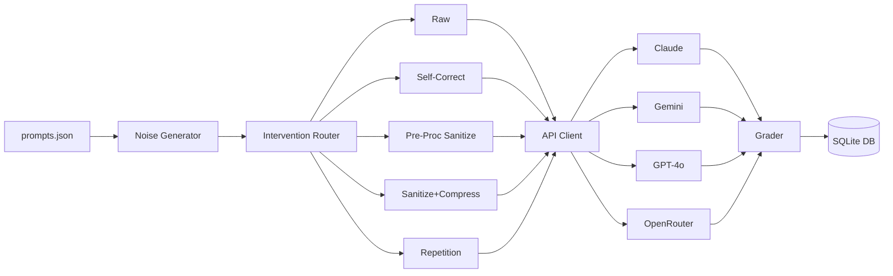
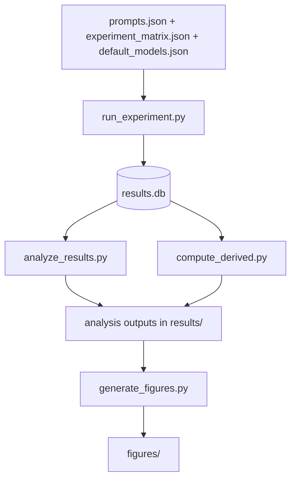
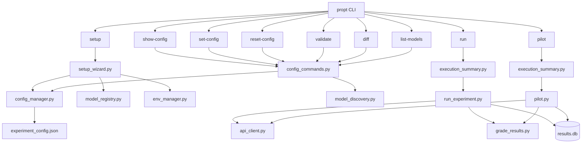
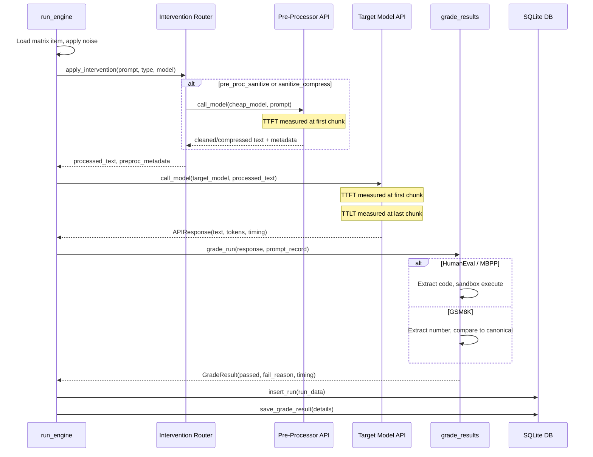

# Architecture

The Linguistic Tax toolkit is a batch-processing research pipeline, not a web service. It ingests benchmark prompts, applies controlled noise and intervention strategies, sends them to LLM APIs, grades the responses, and produces statistical analyses and publication figures.

```
prompts -> noise -> interventions -> API calls -> grading -> analysis -> figures
```

## Pipeline Architecture



> **Note:** The 4 providers shown above are the defaults shipped with `data/default_models.json`. Providers are configurable -- add or remove models via `propt setup` or by editing `data/default_models.json`.

Prompts are loaded from `data/prompts.json` (200 clean benchmarks from HumanEval, MBPP, and GSM8K). The noise generator applies Type A character-level mutations (random typos at 5/10/20% error rates) or Type B ESL syntactic patterns (L1 transfer errors that simulate how non-native English speakers from Mandarin, Japanese, or Spanish backgrounds write English -- e.g., dropping articles, confusing prepositions, reordering adjectives). See [Getting Started: Noise Types](getting-started.md#noise-types) for detailed examples. The intervention router selects one of five strategies. The API client sends the processed prompt to the target model, measures TTFT and TTLT, and streams the response. The grader evaluates correctness (code execution sandbox for HumanEval/MBPP, regex number extraction for GSM8K) and writes everything to SQLite.

## Data Flow



The experiment matrix (`data/experiment_matrix.json`) defines the full factorial design: 200 prompts x 8 noise types x 5 interventions x 4 models x 5 repetitions. Model configurations are loaded from `data/default_models.json` into the `ModelRegistry`, which provides pricing, preprocessor mappings, and rate limit delays to all consumers. `run_experiment.py` processes each work item and writes results to `results/results.db`. Post-experiment, `compute_derived.py` calculates per-prompt Consistency Rate, quadrant classification, and cost rollups. `analyze_results.py` runs GLMM, bootstrap CIs, McNemar's test, and Kendall's tau. Finally, `generate_figures.py` produces publication-quality PDF and PNG figures.

## CLI Command Map



All CLI commands are registered via argparse subparsers in `src/cli.py`. The `propt` entry point is defined in `pyproject.toml` (`propt = "src.cli:main"`).

## API Call Lifecycle



Rate limiting uses per-model delays from `ModelRegistry` (loaded from `data/default_models.json`) with adaptive backoff: on 429 errors, the delay doubles and the request retries up to 3 times with exponential backoff (1s, 4s, 16s).

## Module Reference

### Configuration Layer

| Module | Purpose | Key Functions/Classes |
|--------|---------|----------------------|
| `config.py` | Experiment parameters and noise/intervention constants | `ExperimentConfig`, `derive_seed()`, `NOISE_TYPES`, `INTERVENTIONS`, `MAX_TOKENS_BY_BENCHMARK` |
| `model_registry.py` | Config-driven model registry: pricing, preproc mappings, rate limits | `ModelConfig` (dataclass), `ModelRegistry`, `registry` (module-level singleton) |
| `config_manager.py` | Config file I/O and validation | `find_config_path()`, `load_config()`, `save_config()`, `validate_config()`, `get_full_config_dict()` |
| `config_commands.py` | CLI config subcommand handlers | `handle_show_config()`, `handle_set_config()`, `handle_reset_config()`, `handle_validate()`, `handle_diff()`, `handle_list_models()` |

### Environment and Discovery Layer

| Module | Purpose | Key Functions/Classes |
|--------|---------|----------------------|
| `env_manager.py` | .env file loading, writing, and API key management | `load_env()`, `write_env()`, `check_keys()`, `PROVIDER_KEY_MAP` |
| `model_discovery.py` | Live model queries from provider APIs (Anthropic, Google, OpenAI, OpenRouter) | `discover_all_models()`, `DiscoveredModel` (dataclass), `DiscoveryResult` (dataclass) |

### Data Layer

| Module | Purpose | Key Functions/Classes |
|--------|---------|----------------------|
| `db.py` | SQLite schema and queries | `init_database()`, `insert_run()`, `query_runs()`, `save_grade_result()` |
| `noise_generator.py` | Type A and Type B noise injection | `inject_type_a_noise()`, `inject_type_b_noise()`, `identify_protected_spans()`, `build_adjacency_map()` |

### Intervention Layer

| Module | Purpose | Key Functions/Classes |
|--------|---------|----------------------|
| `prompt_compressor.py` | Sanitize and compress via cheap model | `build_self_correct_prompt()`, `sanitize()`, `sanitize_and_compress()` |
| `prompt_repeater.py` | Query duplication per Leviathan et al. | `repeat_prompt()` |

### Execution Layer

| Module | Purpose | Key Functions/Classes |
|--------|---------|----------------------|
| `run_experiment.py` | Execution engine with resumability | `run_engine()`, `apply_intervention()`, `make_run_id()` |
| `api_client.py` | Multi-provider API wrapper with streaming | `call_model()`, `APIResponse` (frozen dataclass), `_validate_api_keys()` |
| `execution_summary.py` | Pre-execution summary and confirmation gate | `estimate_cost()`, `estimate_runtime()`, `format_summary()`, `confirm_execution()`, `save_execution_plan()`, `count_completed()` |
| `pilot.py` | Pilot validation (20-prompt subset) | `run_pilot()`, `select_pilot_prompts()`, `filter_pilot_matrix()`, `audit_data_completeness()`, `run_pilot_verdict()` |

### Grading Layer

| Module | Purpose | Key Functions/Classes |
|--------|---------|----------------------|
| `grade_results.py` | HumanEval sandbox + GSM8K regex grading | `grade_run()`, `grade_code()`, `grade_math()`, `extract_code()`, `batch_grade()` |

### Analysis Layer

| Module | Purpose | Key Functions/Classes |
|--------|---------|----------------------|
| `analyze_results.py` | Statistical analysis suite | `fit_glmm()`, `compute_bootstrap_cis()`, `run_mcnemar_analysis()`, `compute_kendall_tau()`, `apply_bh_correction()`, `run_sensitivity_analysis()`, `generate_effect_size_summary()` |
| `compute_derived.py` | Derived metrics: CR, quadrants, cost | `compute_cr()`, `classify_quadrant()`, `compute_derived_metrics()`, `compute_quadrant_migration()`, `compute_cost_rollups()` |

### Visualization Layer

| Module | Purpose | Key Functions/Classes |
|--------|---------|----------------------|
| `generate_figures.py` | Publication figure generation | `generate_accuracy_curves()`, `generate_quadrant_plot()`, `generate_cost_heatmap()`, `generate_kendall_plot()` |

### CLI Layer

| Module | Purpose | Key Functions/Classes |
|--------|---------|----------------------|
| `cli.py` | CLI entry point with 9 subcommands | `build_cli()`, `main()`, `handle_run()`, `handle_pilot()` |
| `setup_wizard.py` | Interactive setup wizard | `run_setup_wizard()`, `check_environment()`, `validate_api_key()` |

## ModelRegistry Configuration Flow

Model configuration follows a layered loading pattern:

1. **Default models** (`data/default_models.json`) define the curated set of 4 target models and 4 preprocessor models with pricing, preproc mappings, and rate limit delays.
2. **ModelRegistry** (`src/model_registry.py`) loads defaults at import time into a module-level `registry` singleton. All consumers import `registry` directly.
3. **User configuration** (`experiment_config.json`) can override the model list via the `models` field. When loaded by `config_manager`, the registry is reloaded with user-specified models via `registry.reload()`.
4. **Consumers** (`api_client`, `execution_summary`, `run_experiment`, `compute_derived`, etc.) call `registry.get_price()`, `registry.get_delay()`, `registry.get_preproc()`, and `registry.compute_cost()` instead of accessing hardcoded constants.

## Database Schema

All experiment data is stored in a single SQLite database (`results/results.db`) with WAL journal mode for concurrent read performance. Three tables:

### experiment_runs

The primary table storing one row per API call.

| Column | Type | Description |
|--------|------|-------------|
| `run_id` | TEXT PK | Deterministic ID: `prompt_id|noise_type|noise_level|intervention|model|repetition` |
| `prompt_id` | TEXT | Benchmark prompt identifier |
| `benchmark` | TEXT | `humaneval`, `mbpp`, or `gsm8k` |
| `noise_type` | TEXT | One of 8 noise conditions |
| `intervention` | TEXT | One of 5 interventions |
| `model` | TEXT | Target model identifier |
| `repetition` | INTEGER | Repetition number (1-5) |
| `prompt_text` | TEXT | The processed prompt sent to the model |
| `prompt_tokens` | INTEGER | Input token count |
| `optimized_tokens` | INTEGER | Output tokens from pre-processor (if applicable) |
| `raw_output` | TEXT | Full LLM response text |
| `pass_fail` | INTEGER | 1 = pass, 0 = fail |
| `ttft_ms` | REAL | Time to first token (milliseconds) |
| `ttlt_ms` | REAL | Time to last token (milliseconds) |
| `preproc_model` | TEXT | Pre-processor model used (if applicable) |
| `preproc_input_tokens` | INTEGER | Pre-processor input tokens |
| `preproc_output_tokens` | INTEGER | Pre-processor output tokens |
| `total_cost_usd` | REAL | Total cost including pre-processing |
| `status` | TEXT | `pending`, `completed`, or `failed` |
| `timestamp` | TEXT | ISO 8601 UTC timestamp |

Indexed on: `prompt_id`, `(noise_type, intervention, model)`, `status`.

### derived_metrics

Computed by `compute_derived.py`. One row per (prompt, condition, model) triple.

| Column | Type | Description |
|--------|------|-------------|
| `prompt_id` | TEXT | Benchmark prompt identifier |
| `condition` | TEXT | Combined `noise_type_intervention` string |
| `model` | TEXT | Target model identifier |
| `consistency_rate` | REAL | Pairwise CR across repetitions |
| `majority_pass` | INTEGER | 1 if majority of repetitions passed |
| `quadrant` | TEXT | `robust`, `confidently_wrong`, `lucky`, or `broken` |
| `mean_total_cost_usd` | REAL | Average cost across repetitions |
| `token_savings` | INTEGER | Mean token savings from compression |

Primary key: `(prompt_id, condition, model)`.

### grading_details

Diagnostic metadata from the grading pipeline. One row per graded run.

| Column | Type | Description |
|--------|------|-------------|
| `run_id` | TEXT PK | References `experiment_runs.run_id` |
| `fail_reason` | TEXT | Reason code: `syntax_error`, `timeout`, `wrong_answer`, etc. |
| `extraction_method` | TEXT | GSM8K extraction method: `latex_boxed`, `integer`, etc. |
| `stdout` | TEXT | Captured stdout from sandbox execution |
| `stderr` | TEXT | Captured stderr from sandbox execution |
| `execution_time_ms` | REAL | Wall-clock grading time |

## Configuration System

All experiment parameters are defined in an `ExperimentConfig` dataclass in `config.py`:

```python
@dataclass
class ExperimentConfig:
    models: list[dict] | None = None
    config_version: int = 2
    base_seed: int = 42
    type_a_rates: tuple[float, ...] = (0.05, 0.10, 0.20)
    type_a_weights: tuple[float, ...] = (0.40, 0.25, 0.20, 0.15)
    repetitions: int = 5
    temperature: float = 0.0
    prompts_path: str = "data/prompts.json"
    matrix_path: str = "data/experiment_matrix.json"
    results_db_path: str = "results/results.db"
```

The `models` field accepts a list of model configuration dicts (matching the `data/default_models.json` schema). When `None`, the `ModelRegistry` uses defaults from `data/default_models.json`.

### Sparse Override Pattern

The config file (`experiment_config.json`) stores only properties that differ from defaults. When loaded, `config_manager.load_config()` merges overrides onto `ExperimentConfig()` defaults. This means:

- A missing config file uses all defaults
- An empty `{}` config file uses all defaults
- Only explicitly changed values are persisted

### Validation

`config_manager.validate_config()` checks:

- Model identifiers exist in `ModelRegistry` (via `registry.get_price()`)
- `type_a_rates` values are in [0, 1]
- `repetitions` >= 1
- `temperature` >= 0
- File paths exist on disk (for `prompts_path` and `matrix_path`)

Run `propt validate` to check the current configuration.

## Design Decisions

### Registry pattern for model configuration

`ModelRegistry` with `data/default_models.json` replaces the hardcoded `MODELS`, `PRICE_TABLE`, `PREPROC_MODEL_MAP`, and `RATE_LIMIT_DELAYS` constants that were previously in `config.py`. The registry is loaded at import time as a module-level singleton and can be reloaded when user configuration is applied. This allows adding or changing models without code changes -- users edit `data/default_models.json` or use the `propt setup` wizard for runtime configuration.

### .env file management

`env_manager.py` integrates `python-dotenv` for API key storage. The setup wizard creates and updates `.env` files automatically with `chmod 600` permissions. This follows standard practice for secret management: keys stay out of config files and version control, and the wizard can validate keys on the spot.

### Live model discovery

`model_discovery.py` queries provider APIs (Anthropic, Google, OpenAI, OpenRouter) in parallel to discover available models with context windows and pricing. Users see actual available models when running `propt list-models`, which reduces configuration errors compared to manually looking up model identifiers.

## Cross-References

- [Research Design Document (RDD)](RDD_Linguistic_Tax_v4.md) -- authoritative spec for all experimental parameters, metrics, and analysis methods
- [Getting Started](getting-started.md) -- end-to-end walkthrough from installation to first results
- [Analysis Guide](analysis-guide.md) -- interpreting statistical output, reading figures, running queries
