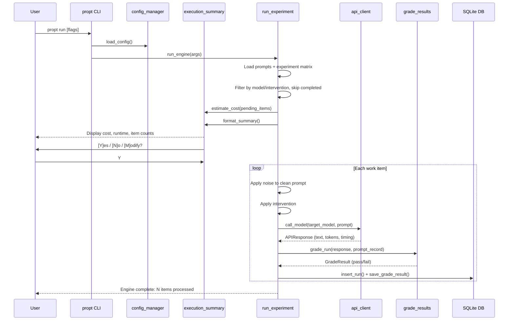

# Getting Started

This guide walks you from a fresh clone to viewing your first experimental results.

## Prerequisites

- **Python >= 3.12** -- check with `python --version`
- **[uv](https://docs.astral.sh/uv/)** -- install with `curl -LsSf https://astral.sh/uv/install.sh | sh`
- **At least one API key** for a supported provider (see [Configuration](#configuration))
- **~500 MB disk space** for dependencies
- OpenRouter with free Nemotron models requires no API spend

## Installation

```bash
git clone https://github.com/sscargal/linguistic-tax.git
cd linguistic-tax
uv sync
```

Verify the installation:

```bash
propt --help
```

You should see all 9 subcommands listed: `setup`, `show-config`, `set-config`, `reset-config`, `validate`, `diff`, `list-models`, `run`, `pilot`.

## Configuration

### Run the Setup Wizard

The recommended way to configure the toolkit is with the interactive setup wizard:

```bash
propt setup
```

The wizard walks through:

1. **Environment check** -- verifies Python version and required packages
2. **Existing config detection** -- if a config exists, offers to add a provider, reconfigure, or start fresh
3. **Provider selection** -- multi-select from Anthropic, Google, OpenAI, and OpenRouter (comma-separated, e.g., `1,3`)
4. **API key collection** -- for each provider, enter or confirm your API key (stored in `.env` at project root)
5. **Model roles explanation** -- describes target models (the LLMs being tested) vs. pre-processor models (cheap, fast models that clean prompts)
6. **Model selection** -- for each provider, enter a target model ID (free text with default shown) and a pre-processor model (auto-assigned from registry, overridable). Type `list` to browse available models live from the provider API.
7. **Validation pings** -- the wizard pings each selected target model with a minimal API call to verify access
8. **Budget preview** -- displays estimated experiment cost for both pilot (20 prompts) and full (200 prompts) runs based on selected models' pricing
9. **Confirmation** -- review the configuration summary table and save

This creates `experiment_config.json` in your project root with your model selections and overrides.

For CI or non-interactive environments:

```bash
propt setup --non-interactive
```

### API Keys

`propt setup` creates and manages a `.env` file at the project root automatically. You can also manage keys manually using either method:

**Option 1 -- `.env` file (recommended, created by `propt setup`):**

```
# .env (project root)
ANTHROPIC_API_KEY=sk-ant-...
GOOGLE_API_KEY=AI...
OPENAI_API_KEY=sk-...
OPENROUTER_API_KEY=sk-or-...
```

**Option 2 -- Shell export:**

```bash
export ANTHROPIC_API_KEY="sk-ant-..."
export GOOGLE_API_KEY="AIza..."
export OPENAI_API_KEY="sk-..."
export OPENROUTER_API_KEY="sk-or-..."
```

The `.env` file is loaded automatically at startup and does not override existing environment variables. Keys written by the wizard have chmod 600 (owner-only access).

**Default models (configurable via `propt setup`):**

| Provider | Env Variable | Default Target Model | Default Preproc Model | Cost |
|----------|-------------|----------------------|----------------------|------|
| Anthropic | `ANTHROPIC_API_KEY` | claude-sonnet-4-20250514 | claude-haiku-4-5-20250514 | $3.00/$15.00 per 1M tokens |
| Google | `GOOGLE_API_KEY` | gemini-1.5-pro | gemini-2.0-flash | $1.25/$5.00 per 1M tokens |
| OpenAI | `OPENAI_API_KEY` | gpt-4o-2024-11-20 | gpt-4o-mini-2024-07-18 | $2.50/$10.00 per 1M tokens |
| OpenRouter | `OPENROUTER_API_KEY` | openrouter/nvidia/nemotron-3-super-120b-a12b:free | openrouter/nvidia/nemotron-3-nano-30b-a3b:free | Free |

All model names and pricing come from the `ModelRegistry` (loaded from `data/default_models.json`). Use `propt list-models` to see all available models with live pricing.

> **Pre-processor model choice matters.** Reasoning models (e.g., `gpt-5-nano`, `o3-mini`, `o4-mini`) generate hidden chain-of-thought that inflates output tokens (5x ratio observed) and increases latency (3.6s TTFT). Use non-reasoning models for pre-processing:
>
> | Provider | Recommended Pre-processor |
> |----------|--------------------------|
> | Anthropic | `claude-haiku-4-5-20250514` |
> | Google | `gemini-2.0-flash` |
> | OpenAI | `gpt-4o-mini` |
> | OpenRouter | Any non-reasoning model |
>
> The toolkit automatically skips pre-processing for clean and ESL prompts (where it provides no benefit), only running it for typo-injected (type_a) noise conditions.

### Manual Configuration

Set individual experiment properties without the wizard:

```bash
propt set-config temperature 0.0
propt set-config results_db_path results/my_results.db
propt set-config repetitions 3
```

Validate your configuration:

```bash
propt validate
```

For model configuration, use `propt setup` -- the `models` field in the config is a structured list managed by the wizard.

## How the Experiment Works

This toolkit measures how **prompt noise** degrades LLM reasoning accuracy, and whether automated **prompt optimization** can recover it.

### Noise Types

Each clean benchmark prompt is corrupted with controlled noise before being sent to the target model. There are two categories:

**Type A -- Character-level noise (typos).** Random character mutations at 3 error rates:

| Noise Level | What it does | Example |
|-------------|-------------|---------|
| `type_a_5pct` | 5% of characters mutated | "Write a function" → "Wriet a functon" |
| `type_a_10pct` | 10% of characters mutated | "Write a function" → "Wrtie a fucntion" |
| `type_a_20pct` | 20% of characters mutated | "Write a function" → "Wrtei a fncuiotn" |

Mutations include adjacent-key swaps, character omission, doubling, and transposition. Technical tokens (function names, keywords) are protected from mutation.

**Type B -- ESL syntactic noise (L1 transfer errors).** These simulate how a **non-native English speaker writes English**, applying grammar mistakes characteristic of their first language (L1). All prompts remain in English -- the noise reflects L1 interference patterns documented in second-language acquisition research:

| Noise Variant | L1 Source | What it does to English | Example |
|---------------|-----------|------------------------|---------|
| `type_b_mandarin` | Mandarin Chinese | Drops articles, removes tense markers, omits copula, simplifies prepositions | "Return the sorted list" → "Return sorted list" |
| `type_b_japanese` | Japanese | Drops articles, adds topic markers ("As for X"), drops subject pronouns | "You should find the values" → "As for should, find value" |
| `type_b_spanish` | Spanish | Confuses prepositions, double negatives, adjective-after-noun order | "the large empty list" → "list large empty" |
| `type_b_mixed` | All three | Applies all 16 patterns from all languages | Heaviest transformation |

These are **not** prompts in other languages. They are English prompts with the kinds of grammatical errors that native Mandarin/Japanese/Spanish speakers commonly make when writing English (e.g., article omission in Mandarin because Mandarin has no article system).

### Intervention Strategies

Each noisy prompt is processed through one of 5 strategies before reaching the target model:

| Intervention | What it does |
|-------------|-------------|
| `raw` | Send the noisy prompt as-is (baseline) |
| `self_correct` | Prepend "my prompt may contain errors, correct them first" |
| `pre_proc_sanitize` | Fix spelling/grammar via a cheap pre-processor model |
| `pre_proc_sanitize_compress` | Fix errors AND compress/deduplicate via pre-processor |
| `prompt_repetition` | Repeat the prompt twice (Leviathan et al. technique) |

> **Note:** Pre-processing is automatically skipped for clean prompts and ESL (type_b) noise, where pilot data showed it provides no benefit or actively hurts accuracy. It only runs for type_a (typo) noise.

### Benchmarks

Prompts come from 3 standard benchmarks: **HumanEval** (Python code generation), **MBPP** (Python code generation), and **GSM8K** (grade-school math). Each is graded automatically -- code benchmarks via sandboxed execution, math via regex number extraction.

## Full Experiment Run Flow



## Walkthrough 1: First Pilot Run

The pilot run tests 20 prompts across all noise types and interventions -- a quick validation before committing to the full matrix.

### Step 1: Preview the pilot

```bash
propt pilot --dry-run
```

This shows the pre-execution summary without making any API calls:

```
=== Pre-Execution Summary ===

Models:
Model                                              Role     Input (per 1M)    Output (per 1M)
-------------------------------------------------  -------  ----------------  -----------------
openrouter/nvidia/nemotron-3-super-120b-a12b:free  target   $0.00             $0.00
openrouter/nvidia/nemotron-3-nano-30b-a3b:free     preproc  $0.00             $0.00

Experiment Design:
  Intervention                API Calls
--------------------------  -----------
compress_only                       100
pre_proc_sanitize                   800
pre_proc_sanitize_compress          800
prompt_repetition                   800
raw                                 800
self_correct                        800

  Noise Type       API Calls
---------------  -----------
clean                    600
type_a_10pct             500
type_a_20pct             500
type_a_5pct              500
type_b_japanese          500
type_b_mandarin          500
type_b_mixed             500
type_b_spanish           500

Estimates:
                        API Calls         Tokens (in / out)       Cost (in + out)
                     ────────────  ────────────────────────  ────────────────────
  Target model:             4,100     216,070 / 291,510       $0.00 + $0.00 = $0.00
  Pre-processor:            1,700      89,590 / 70,975        $0.00 + $0.00 = $0.00
                     ────────────  ────────────────────────  ────────────────────
  Total:                    5,800     305,660 / 362,485       $0.00

  Estimated runtime: 34m 10s
```

The exact models, pricing, and token estimates depend on your configuration. Only configured providers appear in the output.

### Step 2: Run the pilot

```bash
propt pilot
```

Review the summary, then enter `Y` to proceed. The toolkit displays a tqdm progress bar during execution.

To skip the confirmation prompt (for scripted use):

```bash
propt pilot --yes --budget 5.00
```

The `--budget` flag exits non-zero if the estimated cost exceeds the threshold.

### Step 3: Check what's in the database

After completion, results are in `results/results.db`. You can query it directly:

```bash
sqlite3 results/results.db "SELECT COUNT(*), AVG(pass_fail) FROM experiment_runs WHERE status='completed'"
```

### Step 4: Compute derived metrics

```bash
python -m src.compute_derived --db results/results.db
```

This computes per-prompt Consistency Rate (CR), quadrant classification (robust/confidently\_wrong/lucky/broken), and cost rollups. Results are written to the `derived_metrics` table and to `results/cost_rollups.json`.

### Step 5: Run statistical analysis

```bash
python -m src.analyze_results all --db results/results.db
```

Subcommands: `glmm`, `bootstrap`, `mcnemar`, `kendall`, `sensitivity`, `all`. Outputs go to `results/analysis/` as JSON and CSV files.

### Step 6: Generate figures

```bash
python -m src.generate_figures all --db results/results.db
```

Generates 4 figure types in the `figures/` directory:

- `robustness_curve.pdf/png` -- accuracy degradation by noise level
- `quadrant_migration.pdf/png` -- stability-correctness scatter
- `cost_model.pdf/png` -- cost-benefit heatmap
- `rank_stability.pdf/png` -- Kendall tau bar chart

## Walkthrough 2: Custom Experiment

Filter to a specific model provider:

```bash
propt run --model claude --limit 50
```

Filter to specific interventions:

```bash
propt run --intervention raw
propt run --intervention self_correct
```

Set a budget gate to prevent overspending:

```bash
propt run --budget 5.00
```

Resume after a failure (reprocesses items with `status='failed'`):

```bash
propt run --retry-failed
```

Scripted or CI mode (auto-accept, budget-gated):

```bash
propt run --yes --budget 10.00
```

Override the database path:

```bash
propt run --db results/experiment_2.db
```

Preview without executing:

```bash
propt run --dry-run
```

## Walkthrough 3: Analyzing Existing Results

If someone shares a `results.db` file, you can run the full analysis pipeline without any API calls:

1. **Compute derived metrics:**

   ```bash
   python -m src.compute_derived --db path/to/results.db
   ```

2. **Run statistical analysis:**

   ```bash
   python -m src.analyze_results all --db path/to/results.db
   ```

3. **Generate figures:**

   ```bash
   python -m src.generate_figures all --db path/to/results.db
   ```

See the [Analysis Guide](analysis-guide.md) for interpreting output tables, reading figures, and running custom queries.

## Configuration Deep Dive

View all configuration with current values and defaults:

```bash
propt show-config
```

Show only modified properties:

```bash
propt show-config --changed
```

Show a single property:

```bash
propt show-config temperature
```

Output as JSON:

```bash
propt show-config --json
```

Diff current config from defaults:

```bash
propt diff
```

List all available models with pricing:

```bash
propt list-models
```

Reset everything to defaults:

```bash
propt reset-config --all
```

Reset a single property:

```bash
propt reset-config temperature
```

## Troubleshooting

**"No config found"** -- Run `propt setup` to create your configuration file before running experiments.

**API key errors** -- Verify your environment variables are set. Check the `.env` file at the project root, or verify shell exports:

```bash
echo $ANTHROPIC_API_KEY   # Should not be empty
```

The wizard validates keys during setup. Re-run `propt setup` to update keys.

**Rate limiting** -- The toolkit has built-in retry logic with exponential backoff (1s, 4s, 16s). If rate limiting persists, reduce the number of items with `--limit` or use a different provider.

**Python version errors** -- This toolkit requires Python >= 3.12 for modern type hints. Check with `python --version`.

**Import errors after install** -- Run `uv sync` to ensure all dependencies are installed. uv manages its own virtual environment automatically.

## Next Steps

- [Architecture](architecture.md) -- understand how the codebase modules connect
- [Analysis Guide](analysis-guide.md) -- interpret statistical output and figures
- [Research Design Document (RDD)](RDD_Linguistic_Tax_v4.md) -- full experimental methodology
- [Experiment Specs](experiments/README.md) -- micro-formatting test designs
