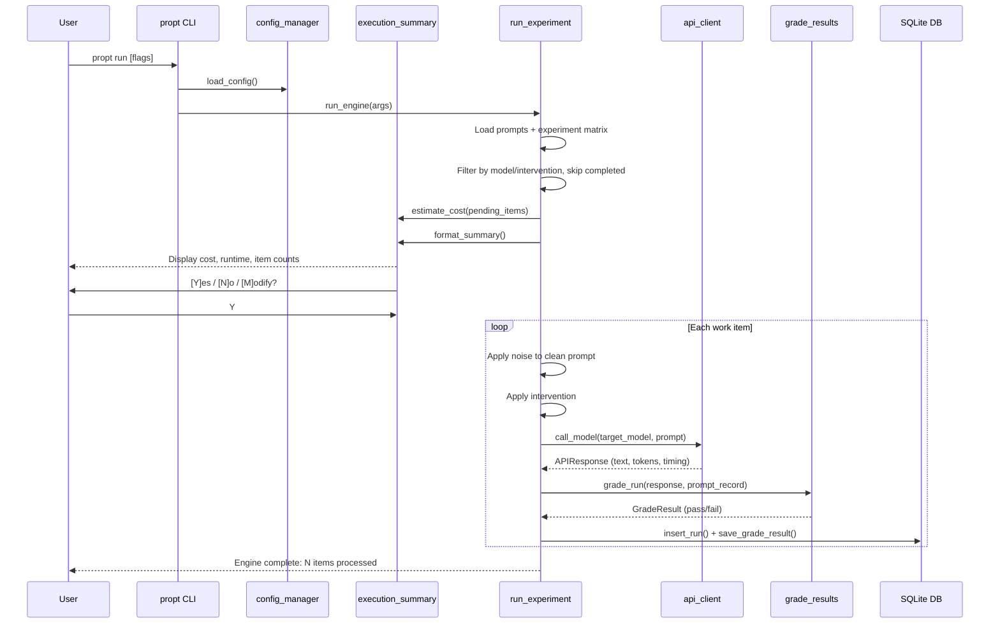

# Getting Started

This guide walks you from a fresh clone to viewing your first experimental results.

## Prerequisites

- **Python >= 3.11** -- check with `python --version`
- **At least one API key** for a supported provider (see [Configuration](#configuration))
- **~500 MB disk space** for dependencies
- OpenRouter with free Nemotron models requires no API spend

## Installation

```bash
git clone https://github.com/<user>/linguistic-tax.git
cd linguistic-tax
python -m venv .venv
source .venv/bin/activate   # On Windows: .venv\Scripts\activate
pip install -e .
```

Verify the installation:

```bash
propt --help
```

You should see all 9 subcommands listed: `setup`, `show-config`, `set-config`, `reset-config`, `validate`, `diff`, `list-models`, `run`, `pilot`.

## Configuration

### Set Environment Variables

Export at least one API key for the provider you plan to use:

```bash
export ANTHROPIC_API_KEY="sk-ant-..."     # For Claude models
export GOOGLE_API_KEY="AIza..."           # For Gemini models
export OPENAI_API_KEY="sk-..."            # For GPT-4o models
export OPENROUTER_API_KEY="sk-or-..."     # For OpenRouter models (free Nemotron)
```

| Provider | Env Variable | Models | Cost |
|----------|-------------|--------|------|
| Anthropic | `ANTHROPIC_API_KEY` | claude-sonnet-4-20250514 | $3.00/$15.00 per 1M tokens |
| Google | `GOOGLE_API_KEY` | gemini-1.5-pro | $1.25/$5.00 per 1M tokens |
| OpenAI | `OPENAI_API_KEY` | gpt-4o-2024-11-20 | $2.50/$10.00 per 1M tokens |
| OpenRouter | `OPENROUTER_API_KEY` | nvidia/nemotron-3-super-120b-a12b:free | Free |

### Run the Setup Wizard

```bash
propt setup
```

The wizard walks through:

1. **Environment check** -- verifies Python version and required packages
2. **Provider selection** -- choose from Anthropic, Google, OpenAI, or OpenRouter
3. **Target model** -- auto-fills the default model for your provider
4. **Pre-processor model** -- auto-filled based on target model (e.g., Haiku for Claude, Flash for Gemini)
5. **API key validation** -- optional test call to verify your key works
6. **File paths** -- prompts, experiment matrix, and results database locations

This creates `experiment_config.json` in your project root with only your overrides from the defaults.

For CI or non-interactive environments:

```bash
propt setup --non-interactive
```

### Manual Configuration

Set individual properties without the wizard:

```bash
propt set-config claude_model claude-sonnet-4-20250514
propt set-config results_db_path results/my_results.db
```

Validate your configuration:

```bash
propt validate
```

## Full Experiment Run Flow



## Walkthrough 1: First Pilot Run

The pilot run tests 20 prompts across all noise types and interventions -- a quick validation before committing to the full matrix.

### Step 1: Preview the pilot

```bash
propt pilot --dry-run
```

This shows the pre-execution summary without making any API calls:

```
=== Pre-Execution Summary ===

Models:
Model                                               Items    Est. Cost
------------------------------------------------  -------  -----------
claude-sonnet-4-20250514                              400        $0.86
gemini-1.5-pro                                        400        $0.28
gpt-4o-2024-11-20                                     400        $0.60
openrouter/nvidia/nemotron-3-super-120b-a12b:free     400        $0.00

Interventions:
Intervention                Items
--------------------------  -------
pre_proc_sanitize               320
pre_proc_sanitize_compress      320
prompt_repetition               320
raw                             320
self_correct                    320

Cost:
  Target model cost:    $1.74
  Pre-processor cost:   $0.04
  Total estimated cost:  $1.78

Runtime:
  Estimated runtime: 8m 0s
```

### Step 2: Run the pilot

```bash
propt pilot
```

Review the summary, then enter `Y` to proceed. The toolkit displays a tqdm progress bar during execution.

To skip the confirmation prompt (for scripted use):

```bash
propt pilot --yes --budget 5.00
```

The `--budget` flag exits non-zero if the estimated cost exceeds the threshold.

### Step 3: Check what's in the database

After completion, results are in `results/results.db`. You can query it directly:

```bash
sqlite3 results/results.db "SELECT COUNT(*), AVG(pass_fail) FROM experiment_runs WHERE status='completed'"
```

### Step 4: Compute derived metrics

```bash
python -m src.compute_derived --db results/results.db
```

This computes per-prompt Consistency Rate (CR), quadrant classification (robust/confidently\_wrong/lucky/broken), and cost rollups. Results are written to the `derived_metrics` table and to `results/cost_rollups.json`.

### Step 5: Run statistical analysis

```bash
python -m src.analyze_results all --db results/results.db
```

Subcommands: `glmm`, `bootstrap`, `mcnemar`, `kendall`, `sensitivity`, `all`. Outputs go to `results/analysis/` as JSON and CSV files.

### Step 6: Generate figures

```bash
python -m src.generate_figures all --db results/results.db
```

Generates 4 figure types in the `figures/` directory:

- `robustness_curve.pdf/png` -- accuracy degradation by noise level
- `quadrant_migration.pdf/png` -- stability-correctness scatter
- `cost_model.pdf/png` -- cost-benefit heatmap
- `rank_stability.pdf/png` -- Kendall tau bar chart

## Walkthrough 2: Custom Experiment

Filter to a specific model provider:

```bash
propt run --model claude --limit 50
```

Filter to specific interventions:

```bash
propt run --intervention raw
propt run --intervention self_correct
```

Set a budget gate to prevent overspending:

```bash
propt run --budget 5.00
```

Resume after a failure (reprocesses items with `status='failed'`):

```bash
propt run --retry-failed
```

Scripted or CI mode (auto-accept, budget-gated):

```bash
propt run --yes --budget 10.00
```

Override the database path:

```bash
propt run --db results/experiment_2.db
```

Preview without executing:

```bash
propt run --dry-run
```

## Walkthrough 3: Analyzing Existing Results

If someone shares a `results.db` file, you can run the full analysis pipeline without any API calls:

1. **Compute derived metrics:**

   ```bash
   python -m src.compute_derived --db path/to/results.db
   ```

2. **Run statistical analysis:**

   ```bash
   python -m src.analyze_results all --db path/to/results.db
   ```

3. **Generate figures:**

   ```bash
   python -m src.generate_figures all --db path/to/results.db
   ```

See the [Analysis Guide](analysis-guide.md) for interpreting output tables, reading figures, and running custom queries.

## Configuration Deep Dive

View all configuration with current values and defaults:

```bash
propt show-config
```

Show only modified properties:

```bash
propt show-config --changed
```

Show a single property:

```bash
propt show-config claude_model
```

Output as JSON:

```bash
propt show-config --json
```

Diff current config from defaults:

```bash
propt diff
```

List all available models with pricing:

```bash
propt list-models
```

Reset everything to defaults:

```bash
propt reset-config --all
```

Reset a single property:

```bash
propt reset-config claude_model
```

## Troubleshooting

**"No config found"** -- Run `propt setup` to create your configuration file before running experiments.

**API key errors** -- Verify your environment variables are exported in the current shell session:

```bash
echo $ANTHROPIC_API_KEY   # Should not be empty
```

**Rate limiting** -- The toolkit has built-in retry logic with exponential backoff (1s, 4s, 16s). If rate limiting persists, reduce the number of items with `--limit` or use a different provider.

**Python version errors** -- This toolkit requires Python >= 3.11 for match/case syntax and modern type hints. Check with `python --version`.

**Import errors after install** -- Make sure you installed in editable mode (`pip install -e .`) and your virtual environment is activated.

## Next Steps

- [Architecture](architecture.md) -- understand how the codebase modules connect
- [Analysis Guide](analysis-guide.md) -- interpret statistical output and figures
- [Research Design Document (RDD)](RDD_Linguistic_Tax_v4.md) -- full experimental methodology
- [Experiment Specs](experiments/README.md) -- micro-formatting test designs
